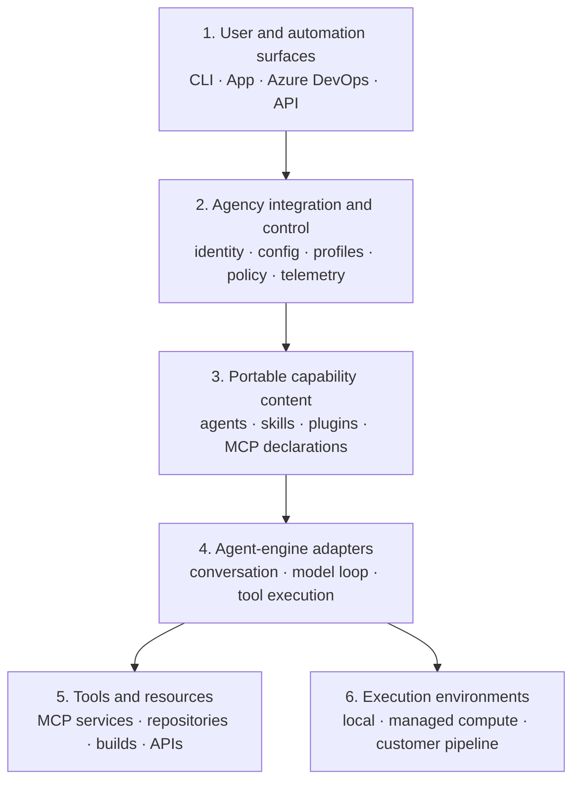
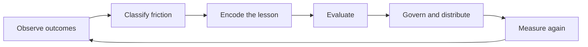

# Agency under the hood

[](https://github.com/xavierxmorris/agency-under-the-hood-guide/actions/workflows/validate.yml)

An evidence-backed field guide to how Agency composes agent engines, reusable
capabilities, enterprise integrations, hosted execution, evaluation, and
continuous improvement.

The central idea is simple:

> **Agency is an integration, governance, and execution control plane around
> supported agent engines. It does not replace their conversation and tool loop.**

This repository is pinned to Agency `2026.9.16.4`. It explains released behavior
from installed documentation and safe CLI observation. It does not reproduce
proprietary implementation code, private endpoints, internal repositories, or
roadmap-only systems.

## The 10-minute mental model

The six-layer view is an interpretation derived from the released surface,
configuration, capability, engine, tool, and hosted-job contracts
([I-002](data/claims.json)).



| Layer | The question it answers |
| --- | --- |
| Surfaces | Where did the request start? |
| Agency control | Which identity, configuration, policy, and capabilities apply? |
| Capability content | Which reusable instructions and tools describe the workflow? |
| Engine adapter | Which engine owns the model-driven execution loop? |
| Tools and resources | Which systems can the agent reach, and what do credentials allow? |
| Execution environment | Where do processes, files, network calls, and builds run, including preview customer pipeline compute where supported? |

See [Architecture](docs/architecture.md) and the generated
[visual guide](site/index.html).

## What Agency owns—and what it does not

**Agency owns or coordinates:**

- configuration discovery, profiles, and provenance;
- Microsoft identity and integration plumbing;
- plugin acquisition, distribution, and marketplace policy;
- custom-agent and MCP composition;
- hosted job entry points and compute selection;
- selected telemetry, support context, and updates.

**The selected engine owns:**

- the conversation;
- model interaction;
- its ordinary tool-use loop;
- engine-specific runtime semantics.

**Your systems still own:**

- authorization in the backing service;
- repository and branch policy;
- build and test correctness;
- network and compute policy;
- independent acceptance criteria and human review.

## Read by goal

| Goal | Start here |
| --- | --- |
| Understand the product boundary | [Architecture](docs/architecture.md) |
| Trace local and hosted runs | [Session lifecycles](docs/session-lifecycles.md) |
| Predict effective settings | [Configuration](docs/configuration.md) |
| Choose agent, skill, plugin, or MCP | [Capability model](docs/capability-model.md) |
| Measure quality and reliability | [Evaluation and improvement](docs/evaluation-and-improvement.md) |
| Review security assumptions | [Trust boundaries](docs/trust-boundaries.md) |
| See version-specific ambiguities | [Known gaps](docs/known-gaps.md) |
| Audit the sources behind claims | [Evidence model](docs/evidence.md) |

## Learning path

The labs move from observation to repeatable improvement:

1. [Observe the installed surface](docs/labs/01-observe-the-surface.md)
2. [Prove configuration precedence](docs/labs/02-prove-config-precedence.md)
3. [Design a plugin eval](docs/labs/03-design-a-plugin-eval.md)
4. [Measure agent reliability](docs/labs/04-measure-agent-reliability.md)
5. [Build an improvement scorecard](docs/labs/05-build-an-improvement-scorecard.md)

For a complete public workshop with skill, MCP, and custom-agent eval projects,
use [ghcp-demo-17-agency-plugin-evals](https://github.com/xavierxmorris/ghcp-demo-17-agency-plugin-evals).

## Improvement loop



Encode each lesson in the strongest practical mechanism:

1. deterministic analyzer or check;
2. regression test;
3. eval;
4. runtime policy;
5. skill or repository guidance.

## Run the repository gate

Requirements: Python 3.11+ and PowerShell 7 for the convenience runner.

```powershell
.\go.ps1 -Check
```

Or run the standard-library commands directly:

```text
python scripts/generate_site.py --check
python scripts/validate.py
python -m unittest discover -s tests -v
```

To capture a safe, local snapshot of version and help surfaces, the probe first
verifies that its temporary directory has no ancestor Agency config, then uses
an isolated synthetic global config:

```powershell
.\go.ps1 -Probe -NoBrowser
```

Artifacts are written under `.artifacts/`, which is ignored by Git.

## Evidence contract

[`data/claims.json`](data/claims.json) separates:

- **facts** with an installed documentation path and section;
- **interpretations** with the fact IDs from which they are derived;
- **recommendations** with the evidence chain that justifies them.

The generated site, tests, and repository validator consume the same data.
Unknown and orphaned claim references, structural evidence drift, and stale
generated output fail the repository gate. Semantic accuracy still requires
reviewing the cited installed source.

To verify fact paths and headings against an installed Agency source tree:

```text
python scripts/verify_installed_evidence.py --source-root <AGENCY_SOURCE_ROOT>
```

## Public-safety boundary

This is a public-safe learning repository, not official product documentation.
Examples use placeholders and synthetic data. The validator rejects common
private URL, local-path, credential, and key patterns. Always prefer the
version-matched documentation installed with your Agency release for operational
decisions.

## License

[MIT](LICENSE)
