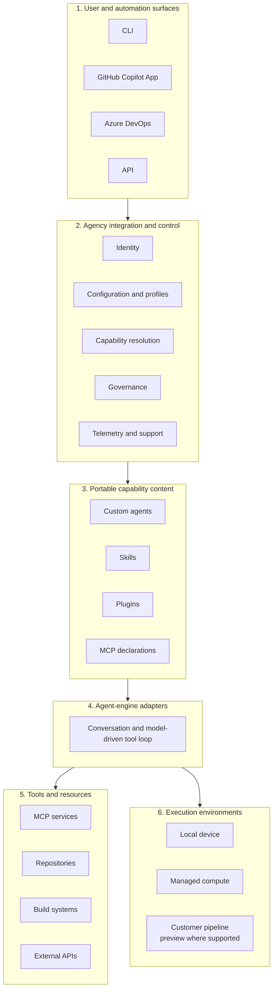

# Architecture

Agency is easiest to understand by separating the engine runtime from the
integration and governance layer around it.

**Documented fact:** Agency describes its client as a thin layer around
supported engines. The engine provides the core conversation and tool runtime
([F-001](../data/claims.json)).

**Interpretation:** Agency is an integration, governance, and execution control
plane around those engines ([I-001](../data/claims.json)).

## Six layers

The six-layer organization is the repository's primary architectural
interpretation ([I-002](../data/claims.json)).

The machine-readable form is
[`data/architecture.json`](../data/architecture.json).

## Responsibility map

| Responsibility | Primary owner | Why it matters |
| --- | --- | --- |
| Model conversation and ordinary tool loop | Selected engine | Engine behavior is not automatically portable or identical. |
| Identity and enterprise integration | Agency | Agency prepares access and integration context. |
| Configuration and profiles | Agency | Effective behavior depends on merged provenance, not one file. |
| Agent and skill instructions | Capability author | Content defines the task contract. |
| Plugin acquisition and marketplace policy | Agency | Distribution and trust are separate from execution. |
| Tool implementation | MCP or external system | The tool provider defines available actions. |
| Authorization | Backing service | Tool visibility is not permission. |
| Build and test correctness | Repository and pipeline | Agent completion is not independent proof. |
| Human acceptance | Reviewers and owners | Governance remains a socio-technical boundary. |

## Portable does not mean identical

Custom agents, skills, and plugins provide portable content, but engine
compatibility is explicit ([F-022](../data/claims.json)). A portable definition
can still encounter different:

- tool names and availability;
- permission prompts;
- hook behavior;
- context limits;
- model choices;
- failure and resume semantics.

Treat the adapter boundary as a test boundary. If a capability declares support
for multiple engines, evaluate it on each engine rather than inferring parity.

## Local and hosted are related, not equivalent

Both modes use agents, plugins, MCPs, and repository context. Their control
boundaries differ ([I-005](../data/claims.json)):

| Boundary | Local session | Hosted job |
| --- | --- | --- |
| Identity | Signed-in local user and engine | Initiating identity plus service execution contracts |
| Configuration | Local discovery and runtime flags | Service-resolved and repository-scoped configuration |
| Compute | User device | Managed compute, or preview customer-controlled compute where supported |
| Network | Device environment | Hosted isolation and allowlists |
| Result | Process output and workspace changes | Job state, logs, artifacts, and optional repository changes |
| Validation | Local checks and review | Pipeline policy, tests, artifacts, and review |

See [Session lifecycles](session-lifecycles.md).

## Architectural consequences

1. **Configuration is code.** It can change tools, plugins, policy, and effective
   behavior.
2. **Plugins are supply-chain inputs.** Availability, trust, ownership, and
   pinning are separate questions.
3. **Tool lists are not authorization.** Credentials and backing services remain
   authoritative.
4. **Evaluation needs two dimensions.** Measure capability quality and repeated
   reliability separately.
5. **Outcome validation is external.** An agent can report completion; builds,
   tests, policy, and review determine acceptance.
