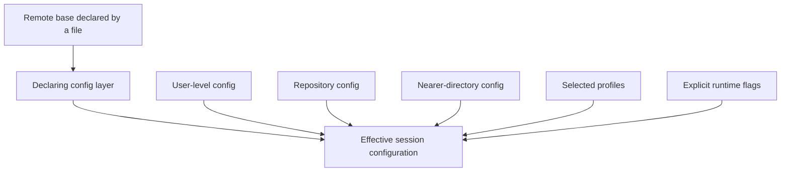

# Configuration

Agency configuration is a merge graph with provenance
([I-003](../data/claims.json)). Predicting behavior from one file is unsafe when
global settings, repository settings, remote bases, profiles, MCP sources, and
runtime flags can all participate.

## Core merge model



Key rules:

- nearer files override more distant files ([F-003](../data/claims.json));
- a declaring file overrides its remote base ([F-004](../data/claims.json));
- multiple selected profiles are order-sensitive;
- isolated profiles remove base and ambient MCP configuration
  ([F-005](../data/claims.json));
- command-line MCPs and other explicit inputs can have capability-specific
  precedence.

## Provenance is part of correctness

Use the runtime to inspect effective behavior:

```text
agency config check --skip-remotes
agency config list --show-source
agency config profiles --json
```

`--show-source` is more reliable than manually reading a directory tree because
it identifies which source supplied each effective value.

## Reproducibility pattern

Use a named, isolated profile for workflows that must not inherit ambient user
or editor configuration ([R-001](../data/claims.json)):

```text
agency copilot --profile-only learning
```

The included [`examples/isolated-profile/agency.toml`](../examples/isolated-profile/agency.toml)
shows a minimal profile.

`--profile-only` drops the base configuration, but profile-level
`remote_config` is not fetched because remote resolution occurs earlier from
the top level. Explicit agent-frontmatter MCPs, command-line `--mcp`, and
code-default builtins can still apply. Disable or constrain those inputs
explicitly when the workflow requires a closed capability set.

For repeatable automation:

1. pin top-level remote config to a tag or revision;
2. pin plugins and artifacts where supported;
3. validate configuration before the run;
4. capture source provenance;
5. record the Agency version;
6. test local and hosted behavior separately.

These are the reproducibility and surface-separation recommendations in
[R-002](../data/claims.json) and [R-007](../data/claims.json).

## Policy scope matters

Some plugin allow, block, and strict-mode controls are service-side policy, not
universal restrictions on every local session. Avoid security statements such
as "this config prevents every local user from loading another plugin" unless
the installed documentation and runtime explicitly prove it.

## Failure strategy differs by environment

Local interactive work generally benefits from fail-fast configuration errors.
Hosted pipelines can prefer continuity for selected retrieval failures. That
tradeoff means a warning can represent a real behavior change: a missing remote
base may leave the run with only local configuration.

Treat configuration warnings as evidence to capture, not noise to hide.

## Recommended configuration review

| Question | Evidence |
| --- | --- |
| Which files participated? | `agency config list --show-source` |
| Did syntax and schema pass? | `agency config check` |
| Were remote sources skipped? | Command flags and logs |
| Which profiles were active? | Invocation and profile listing |
| Were ambient MCPs excluded? | Isolated profile usage |
| Were mutable refs pinned? | Config and plugin specifications |
| Does hosted policy match local behavior? | Separate hosted validation |

Run [Lab 2](labs/02-prove-config-precedence.md) to observe precedence in a
temporary directory after verifying its ancestor chain is clean.
