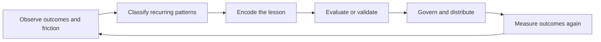

# Evaluation and improvement

Agency provides two measurement systems with different subjects
([F-010](../data/claims.json)).

## Plugin evals versus batch runs

| Dimension | Plugin evals | Batch runs |
| --- | --- | --- |
| Question | Does this capability behave correctly? | How reliably does this agent succeed? |
| Subject | Plugin, skill, or custom agent | Agent configuration |
| Input | Authored scenarios and fixtures | Dataset rows |
| Judgment | Withheld grader and criteria | Exit code, files, or validation scripts |
| Repetition | Scenario suite | Iterations per row |
| Isolation | Container harness by default | Normal execution environment |
| Primary use | Capability quality and routing | Reliability, regression, and benchmarking |

The plugin-evaluation command family is experimental
([F-020](../data/claims.json)). Treat flags and output shape as version-sensitive.

## A useful plugin-eval suite

At minimum:

- three realistic happy paths;
- one ambiguous or unusually shaped edge case;
- one negative case that should decline or avoid the capability;
- independent tasks;
- fixtures where repository context is required;
- grading material that never appears in the user prompt.

Agency withholds grading definitions from the evaluated agent
([F-011](../data/claims.json)). Preserve that boundary in custom tooling.

## Harness choice is a trust decision

The default harness runs tasks in per-task containers. The host harness runs as
the invoking user and is not a malicious-task isolation boundary
([F-012](../data/claims.json)).

Use container isolation for third-party or untrusted content. Use a host harness
only for content you trust with everything available to your local account.

## Reliability means iterations, not retries

Batch iterations are guaranteed executions used to estimate a success rate.
Attempts are retries inside an iteration ([F-013](../data/claims.json)).

If the question is "How often does this work?", increase iterations. Raising
only retries can hide flakiness instead of measuring it.

## Improvement loop

This released loop is an interpretation built from telemetry, readiness,
evaluation, and marketplace guidance ([I-006](../data/claims.json)).

## Strongest-mechanism ladder

When a problem escapes, encode the fix as high on this ladder as practical:

| Mechanism | Use when |
| --- | --- |
| Deterministic analyzer or check | The rule can be decided mechanically |
| Regression test | A known behavior must never return |
| Eval | Correct behavior is scenario-based or non-exact |
| Runtime policy | Safety depends on execution-time context |
| Skill or repository guidance | The rule still requires judgment |

Guidance is valuable but least binding. Track the **durable-fix conversion
rate**: the share of escaped problems converted into one of these mechanisms.

## Measure speed with quality

Do not measure only adoption, sessions, or completion time. Pair:

- cycle time with defect or escape rate;
- agent success rate with human-intervention frequency;
- plugin availability with actual component use;
- job completion with deterministic verification success;
- cost with accepted outcomes.

Agency telemetry is selected and privacy-scrubbed
([F-014](../data/claims.json)). Use correct entity grains and disclose coverage
limits ([R-006](../data/claims.json)).

## Practical next steps

- [Design a plugin eval](labs/03-design-a-plugin-eval.md)
- [Measure agent reliability](labs/04-measure-agent-reliability.md)
- [Build an improvement scorecard](labs/05-build-an-improvement-scorecard.md)
