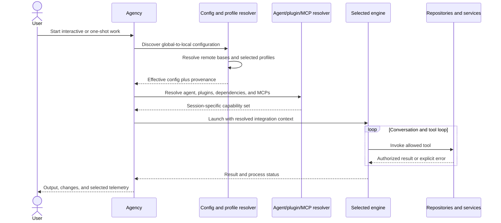
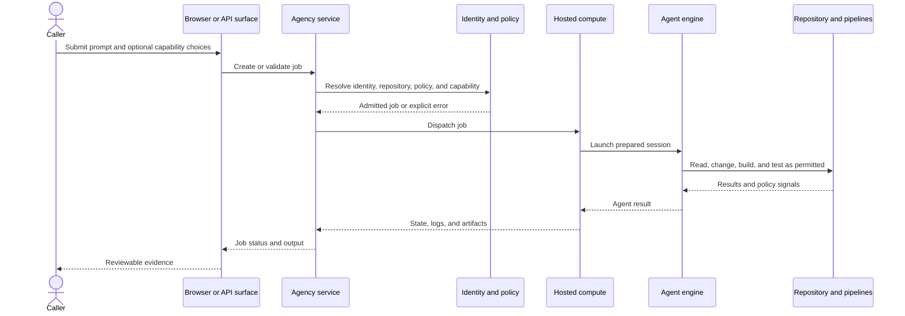

# Session lifecycles

Agency documentation describes the pieces of a run across several topics. The
sequences below are an explicit synthesis, not a quotation from one lifecycle
specification.

## Local session

### Checkpoints

1. **Invocation:** engine, prompt, agent, and optional runtime overrides are
   selected.
2. **Configuration:** files, remote bases, and profiles are merged
   ([F-003](../data/claims.json), [F-004](../data/claims.json),
   [F-005](../data/claims.json)).
3. **Capabilities:** plugins, skills, custom agents, and MCP declarations are
   resolved ([F-006](../data/claims.json)).
4. **Engine launch:** the selected engine receives prepared context
   ([F-001](../data/claims.json)).
5. **Tool calls:** service credentials determine authorization
   ([F-009](../data/claims.json)).
6. **Evidence:** process status, workspace changes, tests, and review establish
   what actually happened.

## Hosted job

The hosted API manages Agency jobs in Azure DevOps
([F-017](../data/claims.json)); the browser experience provides a background
agent entry point ([F-018](../data/claims.json)).

## Where success can be confused

There are several different success signals:

| Signal | What it proves | What it does not prove |
| --- | --- | --- |
| Command exit code | The process reached its success path | The requested change is correct |
| Agent result | The agent believes it completed | External acceptance criteria passed |
| Build success | The configured build passed | Product behavior is correct in every scenario |
| Test success | Covered assertions passed | Untested risks are absent |
| Policy success | Declared policy conditions passed | Human intent was satisfied |
| Review approval | A reviewer accepted the evidence | Future regressions cannot occur |

Use several signals together. For hosted work, independent validation is a
requirement, not an optional polish step ([R-003](../data/claims.json)).

## Failure should remain explicit

Good Agency extensions and workflows:

- surface missing credentials or tools;
- distinguish policy rejection from engine failure;
- preserve build and test diagnostics;
- identify whether a failure occurred during configuration, capability
  resolution, engine execution, tool authorization, or validation;
- avoid returning success-shaped output when mandatory capability is missing.
